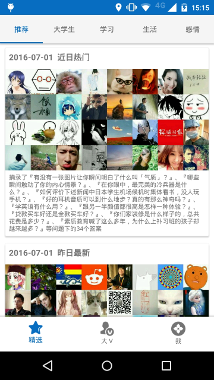
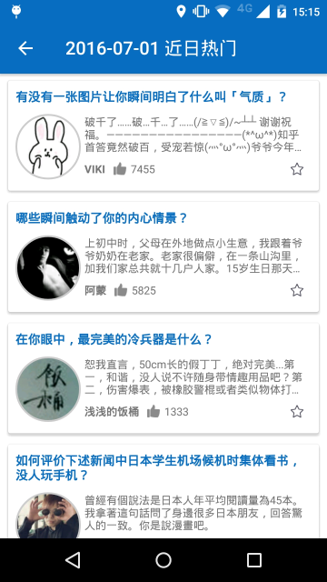
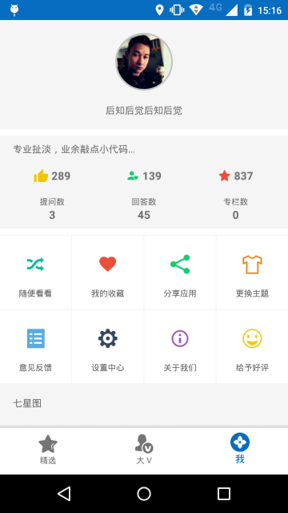

# 知之乎   
zhihu.com Unofficial Client for Android   
第三方知乎客户端，仅作学习用途   

>基于 MVP 模式，使用 Retrofit 2 + RxJava 做网络请求，API 来自[看知乎](http://www.kanzhihu.com/api-document)   

#截图   

   
   
   
   
   
      
	     
		    
			
			

Apache License   
Version 2.0, January 2004   
http://www.apache.org/licenses/    

